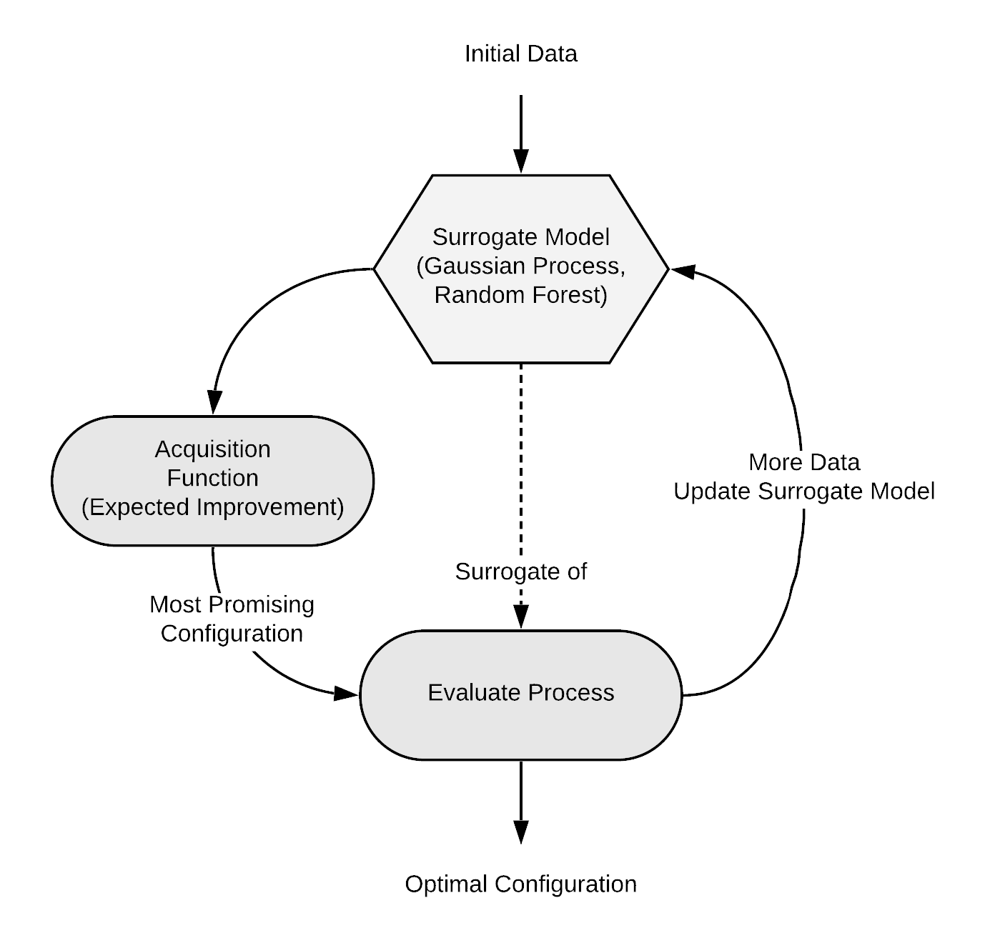

## Overview

{#fig-resample}

For further details, please visit the [mlr3mbo docs](https://mlr3mbo.mlr-org.com/index.html).

Generally, BO follows a simple loop:

1.  Fit the surrogate on all observations so far
2.  Optimize acquisition function to find the next promising candidate for evaluation
3.  Evaluate the next candidate

## MBO Building blocks

There are a few items we need to make `mlr3mbo` work.

1.  `loop_function`
2.  `surrogate`
3.  `acq_function`
4.  `acq_optimizer`

### Loop function

`loop_function` determines the behavior of the BO algorithm on a global level, i.e., how the subroutine should look like that is performed at each iteration.

To get an overview of readily available loop_functions, the following dictionary can be inspected:

```{r}
library(mlr3mbo)
as.data.table(mlr_loop_functions)
```

### Surrogate

A surrogate encapsulates a regression learner that models the unknown black box function based on observed data. In `mlr3mbo`, `SurrogateLearner` and `SurrogateLearnerCollection` are the higher-level R6 classes which should be used to construct a surrogate, inheriting from the base Surrogate class.

As a learner, any `LearnerRegr` from `mlr3` can be used, however, most acquisition functions require both a mean and a variance prediction (therefore not all learners are suitable for all scenarios). Typical choices include:

-   A `Gaussian Process` for low dimensional numeric search spaces
-   A `Random Forest` for higher dimensional mixed (and / or hierarchical) search spaces

A `SurrogateLearner` can be constructed via:

```{r}
surrogate = srlrn(lrn("regr.ranger"))
surrogate$model
```

### Acquisition Function

Based on a surrogate, an acquisition function quantifies the attractiveness of each point of the search space if it were to be evaluated in the next iteration.

To get an overview of available acquisition functions, the following dictionary can be inspected:

```{r}
as.data.table(mlr_acqfunctions)
```

Construction is straightforward via:

```{r}
acq_function = acqf("ei")
acq_function
```

`domain` and `Codomain` should contain something relating to the parameter set and target, respectively. But since lazy initialization is possible, we'll leave this there for now.

### Acquisition Function Optimizer

To find the most promising candidate for evaluation, the acquisition function itself must be optimized. Internally, an `OptimInstance` is constructed using the acquisition function as an `Objective.`

An acquisition function optimizer is then used to solve this optimization problem. Technically, this optimizer is a member of the `AcqOptimizer` R6 class.

Construction requires specifying an `Optimizer` as well as a `Terminator`:

```{r}
library(bbotk)
acq_optimizer = acqo(opt("random_search"), terminator = trm("evals"))

```

We can access the optimizer and terminator as such:

```{r}
acq_optimizer$optimizer

```

```{r}
acq_optimizer$terminator
```

Again, to access more detail on the optimizers:

```{r}
?mlr_optimizers
```

Having introduced all building blocks we are now ready to put everything together in the form of an `OptimizerMbo`. Let's construct it:

```{r}
optimizer = opt("mbo",
  loop_function = bayesopt_ego,
  surrogate = surrogate,
  acq_function = acq_function,
  acq_optimizer = acq_optimizer)
optimizer
```

### Putting it all together!

#### Single-objective: 2D Schwefel Function

```{r}
# ground truth function
objective_function = function(xs) {
  list(y = 418.9829 * 2 - (sum(unlist(xs) * sin(sqrt(abs(unlist(xs)))))))
}
# input parameter space and target
domain = ps(x1 = p_dbl(lower = -500, upper = 500),
  x2 = p_dbl(lower = -500, upper = 500))
codomain = ps(y = p_dbl(tags = "minimize"))

objective = ObjectiveRFun$new(
  fun = objective_function,
  domain = domain,
  codomain = codomain)

instance = OptimInstanceSingleCrit$new(
  objective = objective,
  search_space = domain,
  terminator = trm("evals", n_evals = 20))

# Gaussian Process, EI, DIRECT
surrogate = srlrn(lrn("regr.km",
  covtype = "matern3_2",
  optim.method = "gen",
  nugget.stability = 10^-8, control = list(trace = FALSE)))
acq_function = acqf("ei")
acq_optimizer = acqo(opt("nloptr", algorithm = "NLOPT_GN_DIRECT_L"),
  terminator = trm("stagnation", threshold = 1e-8))
optimizer = opt("mbo",
  loop_function = bayesopt_ego,
  surrogate = surrogate,
  acq_function = acq_function,
  acq_optimizer = acq_optimizer)

set.seed(2906)
optimizer$optimize(instance)
```

```{r}
library(ggplot2)

ggplot(aes(x = batch_nr, y = cummin(y)), data = instance$archive$data) +
  geom_point() +
  geom_step() +
  labs(x = "Batch Nr.", y = "Best y") +
  theme_minimal()
```

```{r}
xdt = generate_design_grid(instance$search_space, resolution = 101)$data
ydt = objective$eval_dt(xdt)
ggplot(aes(x = x1, y = x2, z = y), data = cbind(xdt, ydt)) +
  geom_contour_filled() +
  geom_point(aes(color = batch_nr), size = 2, data = instance$archive$data) +
  scale_color_gradient(low = "lightgrey", high = "red") +
  theme_minimal()
```
