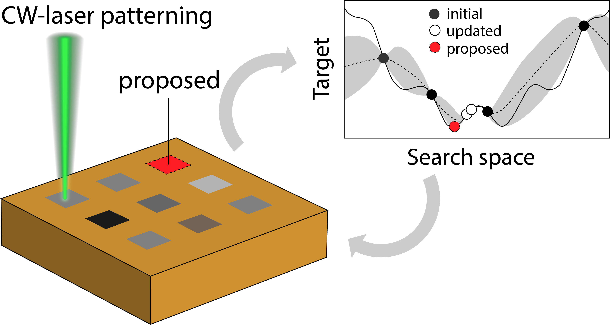

# Why human-in-the-loop?

Real-world scenarios are typically black-box functions. Most domain experts have some hunch or hypothesis of what to test, run some experiments and evaluate the results to decide what to test next. `mlr3mbo` allows proposing a candidate configuration that we can then decide for ourselves whether we want to evaluate it or another value, i.e. we evaluate the objective function manually. The value and the result are then fed back to `mlr3mbo`. Afterwards we can request the next candidate and so on.

```{r}
library(mlr3mbo)
library(bbotk)
library(data.table)
library(dplyr)
library(mlr3tuning)
library(mlr3)
library(paradox)

set.seed(42)
```

Let's reload our materials science data `GOQ` from <https://github.com/aim-uwyo/lig-model-opt>, but first some context:

{#fig-resample}

This experiment optimizes the laser and gas parameters to manufacture high-quality laser-induced graphene, by maximizing the `target` value. Further details refer to our [recent publication](https://ebooks.iospress.nl/volumearticle/60357) - note however that `mlrMBO` was used in that publication.

Let's create our initial data but start with 9 initial data points, sampled equally across different types of gas:

```{r}
dt = subset(read.csv("GOQ.csv"), select = -c(campaign, initial))
data <- data.table(dt %>% group_by(gas) %>% slice_sample(n=3)) 
data
```

We can define our search space, and our targets to optimize:

```{r}
domain = ps(power = p_int(lower = 10, upper = 5550),
            time = p_int(lower = 500, upper = 20000),
            gas = p_fct(c("Argon","Nitrogen", "Air")),
            pressure = p_int(lower = 0, upper = 1000))
codomain = ps(target = p_dbl(tags = "maximize"))
```

We label the initial batch as the first iteration. This is important as `Archive` methods rely on it.

```{r}
data[, batch_nr := 1]
data
```

We can construct `Archive` and initialize it with `data`:

```{r}
archive = Archive$new(search_space = domain, codomain = codomain)
archive$data = data
archive
```

Now we can setup the building blocks `surrogate`, `acq_function` and `acq_optimizer` as before. For defaults, see `?mbo_defaults`.

```{r}
library(mlr3learners)
surrogate = srlrn(lrn("regr.ranger"), archive = archive)
surrogate
```

```{r}
acq_function = acqf("ei", surrogate = surrogate)
acq_function
```

```{r}
acq_optimizer = acqo(opt("random_search", batch_size=1000),
                     terminator = trm("evals", n_evals=1000),
                     acq_function = acq_function)
acq_optimizer
```

Now everything is initialized!

The following would be done repeatedly, i.e. this is now manually performing a single iteration of the BO loop

```{r}
set.seed(42)
acq_function$surrogate$update()
acq_function$update()
candidate = acq_optimizer$optimize()
candidate
```

This is the next parameters that we should run in our experiment! If we chose to evaluate this point, the `target` can then be updated - here, we arbitrarily input the value `target = 3`.

```{r}
data_new = data.table(power = 107, time = 15257, gas = 'Nitrogen', pressure = 35, target = 3)
data_new[, batch_nr := archive$n_batch + 1]
archive$data = rbind(archive$data, data_new, fill=TRUE)
```

The `acq_function` then has the updated `archive`

```{r}
acq_function$archive
```

And retrain our surrogate model with updated data.

```{r}
acq_function$surrogate$update()
acq_function$update()
candidate = acq_optimizer$optimize()
candidate
```
